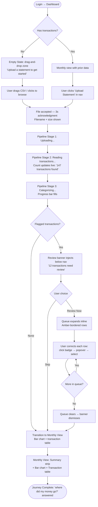

# UX Design Specification mint_personal

**Author:** Neo
**Date:** 2026-03-20

---

<!-- UX design content will be appended sequentially through collaborative workflow steps -->

## Executive Summary

### Project Vision

mint_personal is a simplicity-first personal finance tracker that answers one question brilliantly: *"where did my money go?"* Users upload bank and credit card statements (CSV), an AI categorization engine learns their spending patterns over time, and the application visualizes monthly trends. No budgeting pressure, no bank OAuth friction, no feature bloat. The product earns trust by surfacing uncertainty rather than hiding it — every low-confidence categorization is flagged for fast, single-click correction.

### Target Users

**Primary User — Neo (Personal Finance Reviewer)**
An individual managing personal finances who wants spending visibility without complexity. Uploads CSV statements monthly from multiple institutions (Chase, Amex, BoA, Capital One, Wells Fargo). Values privacy, simplicity, and a tool that measurably improves with use. Technically capable but doesn't want to manage software — wants answers, not tools.

**Platform Admin — Neo as Operator**
Manages the multi-tenant platform: creates user accounts, monitors system health, views operational metrics. Never sees users' financial data — admin role is operational only.

### Key Design Challenges

1. **Empty state and first upload** — The blank dashboard must convert immediately. Zero onboarding friction required; the upload CTA must be the obvious, only thing to do.
2. **The correction review experience** — The review queue is the product's core differentiator. It must feel fast (swipe-like), low-effort, and satisfying — not like homework.
3. **Data trust through visible confidence** — Amber flagging, confidence indicators, and categorization reasoning must communicate uncertainty clearly without creating visual noise or anxiety.

### Design Opportunities

1. **Felt AI improvement** — UI feedback that visibly confirms the model learned ("Uber Eats — remembered from last time") creates retention through product improvement, not features.
2. **The judgment-free monthly summary** — A clean, calm spending view directly counter-positions against alert-heavy alternatives like YNAB and Monarch Money.
3. **Progressive disclosure** — Summary-first architecture with drill-down on demand prevents information overload while keeping depth available.

## Core User Experience

### Defining Experience

The core loop is upload → categorize → review corrections → understand spending. The upload triggers the product; the correction review is where it differentiates. Every other surface (trend charts, transaction list, search) is the reward for completing that loop.

The defining interaction is the correction review queue: a user rapidly assigning correct categories to flagged transactions, with each correction silently improving the model for every subsequent upload. This must feel effortless — fast, low-cognitive-load, and satisfying.

### Platform Strategy

- **Platform:** Desktop-first web SPA (1280px+ primary breakpoint)
- **Input:** Mouse + keyboard; no touch optimization in MVP
- **Interaction model:** Upload-driven — users initiate all actions; no real-time push or polling UX required
- **Offline:** Not required
- **Browser support:** Chrome, Firefox, Safari, Edge (latest 2 versions)

### Effortless Interactions

These actions must require zero cognitive effort:
- **Drag-and-drop upload** — file lands on the dashboard, processing begins automatically
- **Live parsing progress** — status updates without user action ("Reading 147 transactions… Categorizing…")
- **One-click category correction** — click the category badge, pick a new one, done; no dialogs, no confirmation steps
- **Silent pattern application** — similar merchants in the same file auto-correct without user involvement
- **Month navigation** — single-click left/right arrows, no date pickers or dropdowns

### Critical Success Moments

1. **First categorized list (≤ 30 seconds)** — the user's first statement becomes a structured, categorized transaction list. This is the product's proof of value. Failure here ends the session.
2. **"I'll remember that" confirmation** — after the first correction, the app acknowledges the learning. This is the moment trust is established.
3. **First monthly breakdown** — a clean category chart answers "where did my money go?" — the product's core promise fulfilled.
4. **Second upload, fewer corrections** — the AI demonstrably improved. This is the retention trigger.

### Experience Principles

1. **Clarity over completeness** — Show the most important thing first. Never sacrifice clarity to display more information.
2. **Trust through transparency** — Flag every uncertain categorization visibly. Explain reasoning. Make correction a single click. Never silently miscategorize.
3. **The product gets out of the way** — No alerts, nudges, or suggestions the user didn't request. After upload completes, the interface is calm and informational only.
4. **Correction is a conversation, not a task** — The review queue is a rapid exchange, not a form. Speed and brevity respect the user's time.

## Desired Emotional Response

### Primary Emotional Goals

The dominant emotional register for mint_personal is **calm clarity** — the quiet satisfaction of understanding something that was previously opaque. Not excitement or delight-for-its-own-sake. The feeling when you finally see where your money went and it makes sense: relief mixed with insight.

This is a direct counter-position to the anxiety that most personal finance tools create. The product should never make users feel judged, overwhelmed, or behind.

### Emotional Journey Mapping

| Stage | Desired Feeling |
|---|---|
| First arrival (empty dashboard) | Calm curiosity — "this looks approachable" |
| During upload + parsing | Engaged anticipation — "something useful is happening" |
| First categorized list | Satisfying recognition — "yes, that's right" |
| Spotting a miscategorization | Mild amusement, not frustration — "easy fix" |
| After correction + learning confirmation | Trust established — "it's learning" |
| First monthly breakdown | Quiet insight — "now I know" |
| Second upload (fewer corrections) | Felt improvement — "it's getting smarter" |
| Error / messy statement | Confident, not anxious — "it's handling it" |

### Micro-Emotions

- **Confidence over confusion** — The interface never leaves the user wondering what to do
- **Trust over skepticism** — Every categorization decision is explainable; the app shows its work
- **Satisfaction over delight** — This is a tool, not entertainment; satisfaction is the right register
- **Control over anxiety** — The user is always in command; the AI suggests, never imposes
- **Recognition over revelation** — Spending patterns should feel like something you already knew but couldn't articulate

**Emotions to explicitly avoid:** anxiety, overwhelm, guilt, friction, confusion.

### Design Implications

| Emotion Target | UX Approach |
|---|---|
| Calm clarity | Generous whitespace; muted palette; information revealed progressively |
| Engaged anticipation | Animated progress with real-time step labels ("Reading 147 transactions…") |
| Trust through transparency | Confidence indicator + one-click reason tooltip on every categorization |
| Felt improvement | Inline confirmation after corrections ("Uber Eats — remembered from last time") |
| Control | Review queue is opt-in; dashboard never presents as a to-do list |
| Calm error states | Amber (not red) flagging; "needs review" framing, not "error" framing |

### Emotional Design Principles

1. **Never make users feel judged** — No budget alerts, no spending comparisons, no "you spent more than last month" warnings unless requested.
2. **Show the work** — Transparency about AI reasoning builds trust faster than accuracy alone.
3. **Amber, not red** — Uncertainty is normal, not alarming. Flagging conventions should communicate "needs attention" not "something went wrong."
4. **Confirmation creates loyalty** — Small moments of acknowledged learning ("remembered from last time") build the felt sense of a product that's on your side.

## UX Pattern Analysis & Inspiration

### Inspiring Products Analysis

**Linear** — Gold standard for tool-respects-the-user design. Keyboard-first, inline editing, non-blocking confirmations, no unnecessary tooltips or upsells. Model for the correction review queue speed and directness.

**Revolut / Robinhood** — Financial data visualization with restraint. Large readable numbers, clean charts, sparse color use for state communication only. Model for the monthly breakdown and transaction list hierarchy.

**Notion / Apple Notes** — Minimal friction data entry. No modals, no multi-step flows. Inline edit via click → popover → select → close. Model for one-click category correction.

**Calm / Day One** — Judgment-free, private-feeling apps. Palette, typography weight, and deliberate absence of streaks/scores/comparisons communicate that the user is doing something positive. Model for overall visual tone and absence of nudges.

### Transferable UX Patterns

**Navigation:**
- Persistent month selector in header (always navigable, no sub-menus)
- Category filter chips above transaction list (fast filter without sidebar complexity)

**Interaction:**
- Inline popover edit (click category badge → popover → select → auto-close) for corrections
- Animated async state transitions ("Reading 147 transactions…" with subtle progress animation)
- Contextual auto-dismissing toast confirmations ("Uber Eats — remembered from last time")

**Visual:**
- Amber/neutral flagging for "needs attention" states (never red for routine uncertainty)
- Typographic hierarchy as primary organization tool; color reserved for state only
- Small, muted, consistent category color chips in transaction rows

### Anti-Patterns to Avoid

- Dashboard widget overload (multiple competing cards with no clear primary action)
- Red color semantics for spending (anxiety-inducing; use neutral/amber instead)
- Onboarding wizards before first upload
- Modal confirmation dialogs for routine category corrections
- Progress indicators without contextual description ("Reading transactions…" not bare spinner)
- Hard pagination on transaction lists (use virtual scroll for continuous browsing)

### Design Inspiration Strategy

| Action | Pattern | Rationale |
|---|---|---|
| Adopt | Linear inline popover edit | Exact model for one-click correction |
| Adopt | Revolut persistent period selector | Always-accessible month navigation |
| Adopt | Linear toast confirmations | "Remembered from last time" feedback |
| Adopt | Calm/Day One palette restraint | Supports calm clarity emotional goal |
| Adapt | Linear sidebar → filter chips | Simpler for MVP's focused scope |
| Adapt | Robinhood charts → reduced axis density | Calmer data visualization |
| Avoid | Mint.com widget dashboard | Creates the overwhelm we counter-position against |
| Avoid | Red-for-spending | Triggers anxiety; conflicts with emotional goals |

## Design System Foundation

### Design System Choice

**Selected:** Tailwind CSS + shadcn/ui (built on Radix UI primitives)

### Rationale for Selection

- **Solo developer fit** — shadcn/ui components are code-owned (copy-paste, not npm dependency), reducing long-term maintenance risk for a solo maintainer
- **Component coverage** — data table, popover, badge, toast, progress, dropdown menu, and command palette components cover all MVP interaction patterns without custom builds
- **Accessibility** — Radix UI primitives provide WCAG 2.1 AA compliance for keyboard navigation, focus management, and ARIA attributes out of the box
- **Visual control** — Tailwind design tokens give full palette, spacing, and typography control; the aesthetic is steerable toward calm-minimal without fighting a pre-existing visual language
- **Speed** — Design tokens defined once in `tailwind.config`; component variants handled via `cva` (class-variance-authority); consistent, fast implementation

### Implementation Approach

- Define a custom Tailwind palette with warm neutrals as the base, a single amber accent for flagging states, and muted category colors as a fixed set of 8
- Use shadcn/ui for: Table (transaction list), Popover (category correction), Badge (category chips), Toast (learning confirmation), Progress (upload pipeline), DropdownMenu (month navigation), Command (category search within correction popover)
- Chart library: **Recharts** (React-native, customizable, well-suited to Tailwind theming) for monthly breakdown bar chart and trend line chart
- Typography: System font stack with Inter as preferred web font — clean, readable, neutral

### Customization Strategy

- **Color tokens:** Warm neutral base (slate/stone family), single amber accent (`amber-400`), 8 fixed category colors (muted, not saturated)
- **Spacing scale:** Standard Tailwind 4px base grid; generous whitespace via `p-6`/`p-8` container padding
- **Typography scale:** 3-level hierarchy — page title (xl/semibold), section label (sm/medium/muted), data value (base/normal)
- **Component variants:** Category badge variants by category name; status badge variants (uncategorized/reviewed/excluded)
- **Motion:** Minimal — subtle fade-in for toast confirmations; progress bar fill animation during upload pipeline; no decorative animation

## Defining Core Experience

### Defining Experience

> *"Upload a statement, see where your money went."*

The core loop: drag a CSV → automatic categorization → spending picture. This is what users describe to others and what the product delivers in under 30 seconds.

The retention-creating second-order experience: *"The app already knew."* The moment on the second upload when corrections from the first upload apply automatically — transforming the product from useful to trusted.

### User Mental Model

Users arrive from two prior contexts:
- **Former Mint users** — expect automatic categorization, accept correction as normal, familiar with standard category taxonomy
- **Spreadsheet users** — expect manual work; automatic categorization exceeds their expectation immediately

Both share the same core expectation: *I give it my data, it shows me my spending.* Neither expects to teach an AI. The learning mechanic must be introduced through experience (shown, not explained) and rewarded visibly.

**What users hate about existing solutions:** OAuth bank connections that feel invasive, manual categorization that feels like work, feature clutter that buries the simple answer.

### Success Criteria

The core experience succeeds when:
- File accepted and acknowledged in ≤ 3 seconds
- Full categorization completes in ≤ 30 seconds with live stage labels
- Typical 150-transaction statement requires fewer than 10 corrections
- Each correction completes in ≤ 3 seconds (click → select → done)
- Monthly breakdown is immediately legible without explanation
- Second upload shows demonstrably fewer corrections

### Novel UX Patterns

**Established (no education needed):** Upload → process → display pattern. Users understand this from email, document tools, photo apps.

**Novel (must be taught through experience):** The correction-teaches-AI mechanic. Design principles:
1. **Show, don't explain** — toast confirmation ("remembered from last time") teaches through use
2. **Never required** — queue is opt-in; corrections are user-initiated, not demanded
3. **Reward visibly** — past corrections confirmed on subsequent uploads as quiet acknowledgment

### Experience Mechanics

**Initiation:**
- First visit: centered drag-and-drop zone, single CTA "Upload a statement to get started"
- Returning user: last month's breakdown displayed; "Upload another statement" as secondary header action

**Upload → Processing Pipeline:**
```
● Uploading...              [filename, size]
● Reading transactions...   [count updates live as parsed]
● Categorizing...           [progress bar fills]
● Done — 147 transactions categorized
```
Each stage label updates in sequence. No generic spinner.

**Review Queue (if flagged transactions exist):**
- Amber banner: "12 transactions need review" with [Review Now] and [Skip]
- [Review Now]: review queue expands inline below banner (no modal)
- Each flagged row: merchant | amount | category badge (amber border) | flag icon
- Click badge → popover with category list + search → select → badge updates → row dims
- Pattern application note: "Also applied to 3 similar merchants" (inline, subtle)
- Toast: "[Merchant] — remembered for next time" (auto-dismisses, 4 seconds)

**Monthly View (after queue cleared or skipped):**
- Smooth transition to bar chart: categories (X) vs. totals (Y)
- Transaction list below chart, filterable by category chips
- Month navigation: ← [Month Year] → in page header

## Visual Design Foundation

### Color System

**Palette philosophy:** Warm neutrals (stone family) as canvas; amber as the single purposeful accent for flagging states; 8 fixed muted category colors for taxonomy visualization. No red in routine data display — reserved for destructive actions only.

| Role | Token | Value | Usage |
|---|---|---|---|
| Background | `stone-50` | `#FAFAF9` | Page background |
| Surface | `white` | `#FFFFFF` | Cards, panels |
| Surface subtle | `stone-100` | `#F5F5F4` | Table alternates, input backgrounds |
| Border | `stone-200` | `#E7E5E4` | Dividers, card borders |
| Text primary | `stone-900` | `#1C1917` | Headings, key data |
| Text secondary | `stone-500` | `#78716C` | Labels, metadata |
| Text muted | `stone-400` | `#A8A29E` | Placeholder, disabled |
| Accent (flag) | `amber-400` | `#FBBF24` | Uncategorized badge border, review banner |
| Accent bg | `amber-50` | `#FFFBEB` | Review banner background |
| Accent text | `amber-700` | `#B45309` | Amber-on-light text (5.8:1 contrast) |
| Success | `emerald-600` | `#059669` | Toast icon, learning confirmation |
| Destructive | `red-600` | `#DC2626` | Delete/irreversible actions only |

**Category color assignments:**

| Category | Badge pairing |
|---|---|
| Groceries | `bg-green-100 text-green-700` |
| Dining | `bg-orange-100 text-orange-700` |
| Transport | `bg-blue-100 text-blue-700` |
| Shopping | `bg-violet-100 text-violet-700` |
| Subscriptions | `bg-cyan-100 text-cyan-700` |
| Healthcare | `bg-rose-100 text-rose-700` |
| Entertainment | `bg-purple-100 text-purple-700` |
| Utilities | `bg-slate-100 text-slate-700` |

Dark mode: deferred to Phase 2. MVP ships light mode only.

### Typography System

**Font:** Inter (variable weight, Google Fonts) — clean, legible, neutral. System font fallback for performance.

| Level | Class | Size | Weight | Usage |
|---|---|---|---|---|
| Page title | `text-xl font-semibold` | 20px | 600 | Page headings |
| Section label | `text-sm font-medium text-stone-500` | 14px | 500 | Category labels, table headers |
| Body / data | `text-sm text-stone-900` | 14px | 400 | Transaction rows |
| Caption | `text-xs text-stone-400` | 12px | 400 | Timestamps, metadata |
| Amount | `text-sm font-medium tabular-nums` | 14px | 500 | Currency values (tabular alignment) |

All currency values use `tabular-nums` to prevent column jitter.

### Spacing & Layout Foundation

**Base unit:** 4px. All spacing uses multiples of 4.

| Context | Token | Value |
|---|---|---|
| Page container max-width | — | 1280px centered |
| Page horizontal padding | `px-8` | 32px |
| Card padding | `p-6` | 24px |
| Table row padding | `py-3 px-4` | 12px / 16px |
| Section gap | `gap-6` | 24px |

**Layout:** Fixed top nav (64px) + scrollable single-column content area. No sidebar in MVP. Content constrained to 1280px max-width.

### Accessibility Considerations

- All text/background pairings meet WCAG AA (≥ 4.5:1 for normal text)
- `amber-700` on `amber-50`: 5.8:1 ✓ — all category badge pairings verified ≥ 4.5:1 ✓
- Focus rings: `ring-2 ring-stone-900 ring-offset-2` on all interactive elements
- Uncategorized state: amber border + flag icon + text label (never color alone)
- Minimum body text: 14px (Inter); captions 12px minimum

## Design Direction Decision

### Design Directions Explored

Three layout directions were prototyped and evaluated:

**Direction 1 — Focused Single Column:** Sequential vertical layout. Summary strip (4 KPI cards) → bar chart (category totals) → filterable transaction table below. All context in one scrollable column. No persistent sidebar. Month navigation in header.

**Direction 2 — Split Sidebar:** Persistent left sidebar with category list and mini trend chart; right content area updates as categories are selected. Two-panel spatial model.

**Direction 3 — Editorial Minimal:** Typographic-first. No sidebar, no summary cards. Large month heading, horizontal bar chart as prose-style breakdown, simple transaction list. Minimal chrome, maximum data density via whitespace.

Supplementary views prototyped: Empty State, Upload Pipeline, Review Queue.

### Chosen Direction

**Direction 1: Focused Single Column**

### Design Rationale

- Matches the user's mental task order: *see totals → see breakdown → find specific transactions.* The eye follows data top-to-bottom without spatial reorientation.
- Preserves simplicity-first product promise — no sidebar creates no cognitive navigation overhead.
- Single-column layout is naturally responsive and compatible with Phase 2 mobile target.
- Bar chart placement (between summary and table) gives context before detail — users understand totals before drilling into rows.
- KPI summary strip makes the most-asked questions (total spend, top category, month-over-month change) available without scrolling.

### Implementation Approach

- Fixed top nav (64px) with month navigation `← [Month Year] →` and upload action
- Below nav: 4 summary cards in a horizontal strip (Total Spent, Top Category, Transactions, vs Prior Month)
- Bar chart card spanning full column width
- Category filter chips row (All / Groceries / Dining / etc.)
- Transaction table fills remaining column, filtered by active chip
- Review queue banner injects below nav bar when uncategorized transactions exist; dismisses after completion
- Upload pipeline replaces main content area with stage progress during processing

## User Journey Flows

### Journey 1: First Statement Upload

**Entry point:** Authenticated user, no data yet (empty state) or returning user with prior data



**Flow optimization decisions:**
- No redirect on upload — page stays, pipeline overlays content area
- Progress labels are narrative, not percentages ("Reading transactions..." not "33%")
- Review queue is inline — no modal, no page navigation, no context loss
- Skip is always available — corrections are never mandatory

### Journey 2: Messy Statement / Review Queue

**Entry point:** Upload completes with flagged transactions

```mermaid
flowchart TD
    A([Upload Complete — Flagged Transactions]) --> B[Amber banner: 'N transactions need review'\nReview Now / Skip]

    B --> C[User clicks Review Now]
    C --> D[Queue expands inline\nRow: merchant | amount | amber badge | flag icon]

    D --> E[User clicks amber category badge]
    E --> F[Popover opens: category list + search field]
    F --> G{User action}

    G -- Selects category --> H[Badge updates to selected category\nRow dims to 80% opacity]
    G -- Types in search --> I[Category list filters\nUser selects match]
    I --> H

    H --> J{Pattern detected?\nSimilar merchants in file}
    J -- Yes --> K[Inline note: 'Also applied to 3 similar merchants'\nThose rows auto-update and dim]
    J -- No --> L[Continue to next flagged row]
    K --> L

    L --> M[Toast: '[Merchant] — remembered for next time'\nAuto-dismisses 4s, emerald icon]
    M --> N{More in queue?}
    N -- Yes --> D
    N -- No --> O[Queue clears\nBanner dismisses with subtle fade]

    O --> P[Transition to Monthly View]

    D --> Q[User finds $0 transaction\nDistorting totals]
    Q --> R[User clicks row → row actions expand]
    R --> S[User clicks 'Exclude from totals']
    S --> T[Row gets strikethrough styling\nMonthly totals recalculate]
    T --> D
```

**Edge case handling:**
- Zero-amount transactions appear in list and are not filtered automatically
- Inline "Exclude" action available on any transaction row via hover reveal
- Duplicate detection: amber badge with "Possible duplicate — [date] [amount] [merchant]"; user confirms keep/exclude

### Journey 3: Admin — Onboard New User

**Entry point:** Admin navigates to Admin Panel

```mermaid
flowchart TD
    A([Admin Login]) --> B[Admin Dashboard\nUsers table: email | last login | storage | status]

    B --> C[Admin clicks 'New User']
    C --> D[Create User form:\nEmail / Temp Password / Confirm Password]

    D --> E{Form valid?}
    E -- No --> F[Inline field errors]
    F --> D
    E -- Yes --> G[Admin clicks 'Create User']

    G --> H[New user row appears in table\nStatus: Active | Last login: Never]
    H --> I[Toast: 'User created — tenant provisioned']

    I --> J{Admin wants to verify isolation?}
    J -- Yes --> K[Admin clicks user row → User detail]
    K --> L[Operational metrics only:\nStorage used / upload count / last activity]
    L --> M[Financial section: 'Not accessible to admins']
    M --> B
    J -- No --> B

    B --> N[Admin clicks user → Deactivate]
    N --> O[Confirmation dialog: 'Deactivate [email]?\nThey will not be able to log in.']
    O --> P{Admin confirms?}
    P -- Cancel --> B
    P -- Confirm --> Q[User status: Inactive\nRow grays out]
    Q --> B
```

### Journey Patterns

**Navigation patterns:**
- **Stay-on-page processing** — upload, correction, and exclusion all happen without page navigation; content areas update in place
- **Month navigation** — `← [Month Year] →` in header; always visible; keyboard navigable
- **Drill-down filter** — category chips filter the transaction table without loading a new view

**Decision patterns:**
- **Defer always available** — Review queue has [Skip]; no flow requires completing corrections before viewing data
- **Confirm only for destructive actions** — account deactivation and transaction exclusion get confirmation; category reassignment does not
- **Inline pattern application** — when a correction matches similar merchants, match is applied automatically with a soft inline note (no dialog)

**Feedback patterns:**
- **Stage labels over spinners** — upload pipeline uses narrative status labels, not percentage or generic animation
- **Learning toast** — `[Merchant] — remembered for next time` fires after every correction; emerald icon; 4-second auto-dismiss
- **Row dimming on completion** — corrected rows dim (80% opacity) to signal done-ness without removal (preserves scan context)

### Flow Optimization Principles

1. **Time-to-first-insight under 60 seconds** — from file drop to bar chart visible; no intermediate confirmation screens
2. **Never lose scroll position** — inline review queue, inline exclusion, inline pattern notes all preserve table scroll position
3. **Corrections feel like annotation, not work** — popover dismisses on outside click; no save button; change is immediate
4. **Admin can never stumble into financial data** — isolation surfaced as a visible label, not just enforced silently
5. **Every amber state has a clear resolution path** — flagged transactions have two exits: correct or skip; neither is hidden

## Component Strategy

### Design System Components

**shadcn/ui components used as-is:**

| Component | Usage |
|---|---|
| `Button` | Nav actions, form submits, queue Review Now / Skip |
| `Input` | Search field, login form, admin create user |
| `Table` | Transaction list |
| `Card` | Summary KPI cards, chart container |
| `Badge` | Category labels on transactions (extended with color variants) |
| `Toast` | Learning confirmation, upload success, admin actions |
| `Dialog` | Deactivation confirmation |
| `Popover` | Shell for CategoryPickerPopover |
| `Progress` | Upload pipeline progress bar |
| `Separator` | Section dividers |

### Custom Components

**UploadDropZone**
- **Purpose:** Primary CSV upload entry point; handles drag, hover, and click-to-browse
- **States:** `idle` (stone-200 border) → `hover` (stone-400 border) → `drag-over` (amber-400 border, amber-50 bg) → `uploading` (replaced by Pipeline)
- **Accessibility:** `role="button"`, `aria-label="Upload CSV statement"`, keyboard Enter/Space triggers file picker
- **Variants:** Full-page centered (empty state), compact inline (returning user)

**UploadPipeline**
- **Purpose:** Replaces main content during processing; communicates stage and progress narratively
- **Anatomy:** Filename + size → stage label (updates live) → progress bar → transaction count
- **Stages:** `uploading` → `reading` (count increments) → `categorizing` (bar fills) → `complete`
- **Accessibility:** `role="status"` live region; stage labels announced via `aria-live="polite"`

**ReviewBanner + ReviewQueue**
- **Purpose:** Surfaces flagged transactions; expands inline below banner
- **Anatomy:** amber-50 bg banner → flag icon + count → [Review Now] + [Skip] → collapsible queue
- **Row anatomy:** Date | Merchant | Amount | CategoryBadge (amber border) | FlagIcon
- **Pattern note:** Inline `text-xs` "Also applied to N similar merchants" below row
- **Accessibility:** Banner `role="alert"` on inject; queue `role="list"`

**TransactionRow**
- **Purpose:** Core data row with contextual actions
- **States:** `default` → `hover` (actions reveal) → `corrected` (80% opacity) → `excluded` (strikethrough + muted) → `flagged` (amber badge border)
- **Anatomy:** Date | Merchant | CategoryBadge | Amount (tabular-nums, right-aligned) | HoverActions
- **Accessibility:** `role="row"`; hover actions keyboard-accessible via focus-within

**CategoryPickerPopover**
- **Purpose:** Inline category reassignment from transaction row
- **Anatomy:** Search input → scrollable category list (color dot + label) → immediate selection, no save button
- **Accessibility:** `role="listbox"`, `role="option"`, arrow keys navigate, Enter selects, Escape closes

**MonthNavigator**
- **Purpose:** `← [Month Year] →` header control
- **States:** `→` disabled at current month; `←` disabled at earliest available month
- **Accessibility:** `aria-label="Previous/Next month"`, `aria-disabled` on boundaries

**CategoryFilterChips**
- **Purpose:** Filter transaction table by category; horizontal scrollable row
- **States:** `inactive` (stone-100/stone-700) → `active` (category color pairing); clicking active chip returns to All
- **Accessibility:** `role="radiogroup"`, chips are `role="radio"` with `aria-checked`

**SpendingBarChart**
- **Purpose:** Category totals bar chart; Recharts BarChart wrapper
- **Colors:** Mapped from category name to 8 fixed category colors
- **Tooltip:** Category name | Total | % of month
- **Accessibility:** `role="img"` + `aria-label`; visually-hidden data table as fallback

### Component Implementation Strategy

**Foundation (no modification):** `Button`, `Input`, `Dialog`, `Progress`, `Separator`, `Toast`

**Shells with custom content:** `Card`, `Popover`, `Badge` (extended with category variants)

**Fully custom (Tailwind + design tokens):** `UploadDropZone`, `UploadPipeline`, `ReviewBanner`, `ReviewQueue`, `TransactionRow`, `CategoryFilterChips`, `MonthNavigator`, `SpendingBarChart`

All custom components use stone/amber design tokens — no arbitrary values.

### Implementation Roadmap

**Phase 1 — Critical path (upload → view):**
`UploadDropZone` → `UploadPipeline` → `SpendingBarChart` → `TransactionRow` → `CategoryFilterChips` → `MonthNavigator`

**Phase 2 — Review flow:**
`ReviewBanner` → `ReviewQueue` → `CategoryPickerPopover`

**Phase 3 — Admin and supporting:**
Admin user table → `Dialog` (confirm) → `Toast` (all confirmation states)

## UX Consistency Patterns

### Button Hierarchy

| Level | Variant | Usage |
|---|---|---|
| Primary | `default` (stone-900 bg, white text) | One per view section; most important action (Upload Statement, Create User) |
| Secondary | `outline` (stone-200 border) | Supporting actions alongside primary (Review Now, Skip, Cancel) |
| Ghost | `ghost` (no border, stone-600 text) | Low-emphasis tertiary (month nav arrows, row Exclude) |
| Destructive | `destructive` (red-600 bg) | Irreversible actions only, always inside Dialog (Deactivate, Delete) |

**Rules:** Max one primary button per section. Destructive actions never appear outside a Dialog. Buttons never permanently disabled — if unavailable, explain why inline.

### Feedback Patterns

**Toast notifications** (bottom-right, 4s auto-dismiss):
- `success` (emerald-600 icon): "remembered for next time", "User created", "Statement processed"
- `error` (red-600 icon): upload failed, parse error — includes actionable text ("Try again")
- Toasts are informational only; no undo action in MVP

**Inline feedback** (within context, never toast):
- Form field errors: red-600 text below field, `aria-describedby` linking field to error
- Pattern application: `text-xs text-stone-500` below corrected row — "Also applied to N similar merchants"
- Duplicate flag: amber badge inline — "Possible duplicate"

**Loading / processing:**
- Upload pipeline: replaces content with narrative labels, never a spinner
- API calls < 500ms: no indicator (prevents flash)
- API calls ≥ 500ms: skeleton placeholder matching content shape

**Empty states:**
- No data: centered drop zone + single CTA — never "No data found"
- No filter results: "No [category] transactions this month" + [Clear filter]
- Admin no users: "No users yet. Create the first account."

### Form Patterns

- Validate on blur; re-validate on change once an error is shown
- Labels always visible above field — no placeholder-as-label
- Password fields: show/hide toggle (`eye` icon, right-aligned inside input)
- Submit button disabled only during in-flight request (shows spinner in button); re-enables on response

### Navigation Patterns

**Top nav (fixed, 64px):**
- Logo (left) → nav links → [Upload Statement] primary button (right)
- Active link: `text-stone-900 font-medium`; inactive: `text-stone-500`
- Admin users see "Admin" link; regular users do not

**Month navigation:** `← [Month Year] →` in content area, not nav bar. Left/right arrow keys navigate when control is focused.

**In-page:** Category filter chips replace tab navigation for transaction table. No breadcrumbs (single-level SPA).

### Modal and Overlay Patterns

**Dialog** — destructive confirmation only (never for forms or corrections):
- Structure: Title → consequence text → [Cancel] secondary + [Confirm] destructive
- Escape key and backdrop click = cancel
- Focus trapped within Dialog while open

**Popovers** (CategoryPickerPopover):
- Opens on click, closes on outside click or Escape
- Never for destructive actions
- Width: min 200px, max 280px

### Search and Filter Patterns

**Transaction search:**
- Single input, searches merchant + amount
- 300ms debounce (not Enter-to-search)
- No results: "No transactions matching '[query]'" + [Clear search]
- Search and category filter compose simultaneously

**Category filter chips:**
- Single-select; clicking active chip deselects (returns to All)
- Only shows categories present in current month
- Horizontal scroll with fade mask on edges if many categories

## Responsive Design & Accessibility

### Responsive Strategy

mint_personal is **desktop-first** — primary use case is monthly financial review at a desk. Phase 2 adds full mobile; MVP ships functional-but-unoptimized mobile.

| Breakpoint | Target | Strategy |
|---|---|---|
| `< 768px` mobile | Functional floor | Single column, no horizontal scroll, charts scale; not the MVP target |
| `768px–1279px` tablet | Readable | Content narrows; summary cards may stack 2×2; table columns reduce |
| `≥ 1280px` desktop | Primary target | Full layout; max-width 1280px centered |

**Desktop:** 4 KPI cards in single strip; bar chart full width; all table columns visible.

**Tablet (< 900px):** Summary cards wrap to 2×2; bar chart unchanged (Recharts `ResponsiveContainer`); hide Date column in table (date shown as `text-xs` in merchant cell).

**Mobile (functional floor):** Table collapses to merchant + amount only; category badge below merchant. Drag-and-drop degrades to tap-to-browse. Review queue popover becomes bottom sheet where browser supports it.

### Breakpoint Strategy

Using Tailwind defaults: `md:` (768px), `lg:` (1024px), `xl:` (1280px). Desktop-first: base styles are desktop; `md:` and below collapse/reduce.

Page container: `w-full max-w-screen-xl mx-auto px-8` — never fixed pixel widths on content.

### Accessibility Strategy

**Target: WCAG 2.1 AA**

**Color and contrast (established in Visual Foundation):**
- All text/bg pairings ≥ 4.5:1 for normal text ✓
- Amber-700 on amber-50: 5.8:1 ✓; all 8 category badge pairings ≥ 4.5:1 ✓
- Never color alone to convey state — amber rows have border + icon + text label

**Keyboard navigation:**
- All interactive elements reachable via Tab in logical DOM order
- Focus ring: `ring-2 ring-stone-900 ring-offset-2` on all interactive elements
- Month navigator: left/right arrow keys when focused
- Category picker: arrow keys navigate list, Enter selects, Escape closes
- Dialog: focus trapped while open; returns to trigger on close
- Skip-to-content link: visually hidden, appears on focus

**Screen reader:**
- Semantic HTML: `<nav>`, `<main>`, `<header>`, `<table>` with `<thead>`/`<tbody>`, `<th scope>`
- Upload pipeline: `role="status"` + `aria-live="polite"` for stage label updates
- Review banner: `role="alert"` on inject
- Chart: `role="img"` + `aria-label`; visually-hidden `<table>` fallback with same data
- Toast: `role="status"` + `aria-live="polite"`

**Touch targets:** Minimum 44×44px enforced at mobile breakpoint via `min-h-[44px]` on chips and interactive elements.

**Motion:** `prefers-reduced-motion` disables progress bar animation and fade transitions; instant state changes preserved.

### Testing Strategy

**Responsive:** Chrome DevTools: 375px, 768px, 1280px, 1440px. Real device testing before each release.

**Browsers:** Chrome, Firefox, Safari, Edge (latest 2 versions) per PRD.

**Accessibility:**
- Automated: `axe-core` / axe DevTools during development
- Keyboard: full flows navigable without mouse before each release
- Screen reader: VoiceOver (macOS/iOS) primary; NVDA on Windows for broader coverage
- Color blindness: Chrome DevTools vision deficiency emulation — verify amber states distinguishable

### Implementation Guidelines

**Responsive:**
- Tailwind breakpoint prefixes only; no arbitrary pixel values
- `overflow-x-auto` wrapper on table at mobile breakpoint
- Recharts `<ResponsiveContainer width="100%" height={300}>` for all charts

**Accessibility:**
- All icon-only buttons: `aria-label` or `<span className="sr-only">`
- Form inputs: `id` + `<label htmlFor>` always paired; placeholder never as sole label
- `aria-live` regions declared in initial render (not dynamically injected)
- `tabindex` never set to positive values — DOM order is tab order
- Semantic HTML first; ARIA roles only where semantics are insufficient
